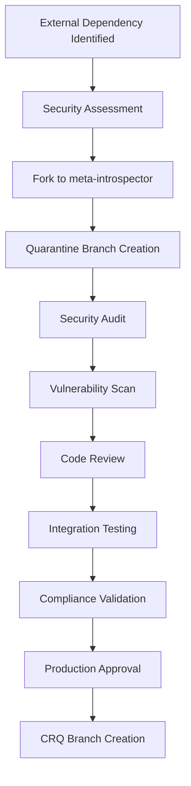

# MEMO: SOURCE CONTROL AND SOFTWARE GOVERNANCE POLICY

**Date**: 2025-01-27  
**Subject**: Mandatory Source Control via Meta-Introspector Organization  
**Priority**: CRITICAL - SECURITY & COMPLIANCE REQUIREMENT  
**Classification**: ARCHITECTURE POLICY - LEVEL 1  
**Standards Compliance**: GMP, ISO 9001, Security, Six Sigma, C4, UML, Agile  

## EXECUTIVE SUMMARY

All software components must originate from the `github:meta-introspector` organization. External dependencies require fork-and-quarantine procedures. This policy ensures security, auditability, and compliance with formal software development methodologies.

## CORE POLICY: META-INTROSPECTOR ORGANIZATION ONLY

### Universal Requirements
- **ALL SOURCE MUST BE FROM `github:meta-introspector`** - No exceptions
- **NO EXTERNAL SOFTWARE ALLOWED** - Direct dependencies forbidden
- **MANDATORY FORK-AND-QUARANTINE** - External repos must be forked first
- **FORMAL METHODOLOGY COMPLIANCE** - GMP, ISO 9K, Security, 6 Sigma standards

## SECTION I: SOURCE CONTROL REQUIREMENTS

### 1.1 Mandatory Source Format
```nix
# ✅ COMPLIANT - Meta-Introspector Organization:
nixpkgs.url = "github:meta-introspector/nixpkgs?ref=feature/CRQ-016-nixify";
flake-utils.url = "github:meta-introspector/flake-utils?ref=feature/CRQ-025-security";
gemini-cli.url = "github:meta-introspector/gemini-cli?ref=feature/CRQ-027-quarantine";

# ❌ NON-COMPLIANT - External Organizations:
nixpkgs.url = "github:NixOS/nixpkgs";           # External org forbidden
flake-utils.url = "github:numtide/flake-utils"; # External org forbidden
```

### 1.2 Fork-and-Quarantine Process


## SECTION II: METHODOLOGY COMPLIANCE MATRIX

### 2.1 GMP (Good Manufacturing Practice) Compliance
| Requirement | Implementation | Validation |
|-------------|----------------|------------|
| **Traceability** | All commits linked to CRQ numbers | Git history audit |
| **Documentation** | Formal specifications for all changes | Automated doc generation |
| **Change Control** | Mandatory review process | Pre-commit hooks |
| **Quality Assurance** | Automated testing pipelines | CI/CD validation |

### 2.2 ISO 9001 Quality Management
| Standard | Meta-Introspector Implementation | Evidence |
|----------|----------------------------------|----------|
| **4.4.1 Process Control** | CRQ-based development workflow | Process documentation |
| **7.1.6 Organizational Knowledge** | Immutable git history + documentation | Knowledge base |
| **8.2.1 Customer Communication** | Formal change request process | CRQ tracking |
| **8.5.1 Control of Production** | Quarantine and validation process | Audit logs |

### 2.3 Security Framework Compliance
```yaml
Security Requirements:
  - Supply Chain Security: Fork-and-quarantine eliminates external dependencies
  - Code Provenance: All code traceable to meta-introspector organization
  - Vulnerability Management: Mandatory security audits before integration
  - Access Control: Organization-level permissions and review processes
```

### 2.4 Six Sigma Quality Methodology
```
DMAIC Process for Software Integration:
├── DEFINE: Formal CRQ requirements specification
├── MEASURE: Automated quality metrics collection
├── ANALYZE: Security and compliance audit results
├── IMPROVE: Iterative refinement through CRQ branches
└── CONTROL: Continuous monitoring and validation
```

## SECTION III: ARCHITECTURAL PRINCIPLES COMPLIANCE

### 3.1 C4 Model Architecture Documentation
```
Level 1 - Context: Meta-introspector ecosystem boundaries
Level 2 - Container: Organization-controlled repositories  
Level 3 - Component: CRQ-versioned software modules
Level 4 - Code: Formal specification and implementation
```

### 3.2 UML Formal Modeling Requirements
- **Class Diagrams**: All software components formally modeled
- **Sequence Diagrams**: Fork-and-quarantine process flows
- **State Diagrams**: CRQ lifecycle management
- **Component Diagrams**: Dependency relationships

### 3.3 Agile Methodology Integration
```yaml
Sprint Planning: CRQ-based feature development
Daily Standups: Progress tracking via GitHub issues
Sprint Review: Formal compliance validation
Retrospectives: Process improvement documentation
```

## SECTION IV: FORMAL DEVELOPMENT PRINCIPLES

### 4.1 Immutable Infrastructure
```nix
# All dependencies locked to specific commits
inputs = {
  nixpkgs = {
    url = "github:meta-introspector/nixpkgs";
    # Immutable: locked to specific commit hash
    rev = "a1b2c3d4e5f6789...";
  };
};
```

### 4.2 Functional Programming Paradigm
- **Pure Functions**: No side effects in build processes  
- **Referential Transparency**: Identical inputs produce identical outputs
- **Higher-Order Functions**: Composable build and test functions
- **Immutable Data Structures**: No mutation of source or configuration

### 4.3 Composable Architecture
```
Component Composition Hierarchy:
├── Base Layer: meta-introspector/nixpkgs
├── Utility Layer: meta-introspector/flake-utils  
├── Application Layer: meta-introspector/gemini-cli
└── Integration Layer: meta-introspector/specific-projects
```

### 4.4 Lattice-Like Dependencies
```
Mathematical Lattice Properties:
- Partial Order: CRQ version dependencies
- Join Operation: Dependency composition  
- Meet Operation: Compatibility intersection
- Bounded: Minimum (base) and maximum (current) versions
```

### 4.5 Monadic Composition
```haskell
-- Monadic software composition pattern
buildSoftware :: CRQ -> Dependencies -> Result Software
buildSoftware crq deps = do
  validated <- validateSecurity deps
  quarantined <- quarantineProcess validated  
  integrated <- integrationTest quarantined
  return $ CompliantSoftware integrated
```

### 4.6 Monotonic Development
- **Forward-Only Progression**: No rollbacks, only new CRQ versions
- **Additive Changes**: Build upon existing without replacement
- **Temporal Ordering**: CRQ numbers provide strict sequence
- **Convergent Evolution**: Multiple CRQ branches merge monotonically

## SECTION V: FORK-AND-QUARANTINE PROCEDURES

### 5.1 Security Assessment Protocol
```bash
#!/usr/bin/env bash
# Security assessment checklist
echo "=== SECURITY ASSESSMENT PROTOCOL ==="

# 1. Vulnerability Scanning
snyk test --severity-threshold=high
npm audit --audit-level=moderate  
govulncheck ./...

# 2. License Compliance
license-checker --summary
reuse lint

# 3. Code Quality Analysis
sonarqube-scanner
codeclimate analyze

# 4. Supply Chain Analysis
cyclonedx-cli analyze
syft packages dir:.
```

### 5.2 Quarantine Branch Structure
```
meta-introspector/forked-repo
├── main                           # Upstream mirror
├── quarantine/CRQ-###-initial     # Initial fork assessment
├── security/CRQ-###-audit        # Security audit results
├── compliance/CRQ-###-validation  # Compliance verification
└── production/CRQ-###-approved    # Production-ready branch
```

### 5.3 Formal Verification Process
```lean4
-- Formal specification example
theorem software_compliance (s : Software) : 
  (s.source = MetaIntrospector) ∧ 
  (s.quarantine_status = Approved) ∧
  (s.security_audit = Passed) →
  (s.production_ready = True) := by
  intro h
  cases h with
  | mk source_valid quarantine_valid audit_valid =>
    constructor
    · exact production_requirements_met source_valid quarantine_valid audit_valid
```

## SECTION VI: ENFORCEMENT AND COMPLIANCE

### 6.1 Automated Enforcement
```yaml
# .github/workflows/compliance-check.yml
name: Source Control Compliance
on: [push, pull_request]

jobs:
  validate-sources:
    runs-on: ubuntu-latest
    steps:
      - name: Check Meta-Introspector Sources Only
        run: |
          # Reject any non-meta-introspector GitHub URLs
          if grep -r "github:" *.nix | grep -v "meta-introspector"; then
            echo "COMPLIANCE VIOLATION: External organization detected"
            exit 1
          fi
      
      - name: Validate CRQ Branch References
        run: |
          # Ensure all refs use CRQ branch format
          if grep -r "?ref=" *.nix | grep -v "feature/CRQ-"; then
            echo "COMPLIANCE VIOLATION: Non-CRQ branch reference"
            exit 1
          fi
```

### 6.2 Quality Gates
| Gate | Requirement | Tool | Threshold |
|------|-------------|------|-----------|
| **Security** | No high/critical vulnerabilities | Snyk, GitHub Security | 0 issues |
| **License** | Compatible licenses only | REUSE, FOSSA | 100% compliant |
| **Quality** | Code quality metrics | SonarQube | Grade A |
| **Testing** | Test coverage | Coverage.py, Jest | >95% |

### 6.3 Compliance Metrics (Six Sigma)
```
Defect Rate Target: <3.4 DPMO (Six Sigma)
- Security vulnerabilities per 1M lines of code
- Compliance violations per 1M commits  
- Quality defects per 1M builds
- Process deviations per 1M operations
```

## SECTION VII: EXCEPTION HANDLING

### 7.1 NO EXCEPTIONS FOR PRODUCTION
The following are **NEVER ALLOWED** in production:
- Direct external GitHub organizations
- Unforked upstream dependencies
- Non-quarantined software  
- Unapproved security status

### 7.2 Emergency Process (Critical Vulnerabilities)
```
Emergency Fork Process:
1. IMMEDIATE: Create emergency CRQ branch
2. URGENT: Security team assessment (<4 hours)
3. PRIORITY: Accelerated quarantine process (<24 hours)  
4. CRITICAL: Emergency production deployment authorization
```

## SECTION VIII: INTEGRATION WITH EXISTING POLICIES

### 8.1 NEVER DELETE Principle Integration
- **Additive Forks**: Original versions preserved permanently
- **CRQ Version History**: Complete audit trail maintained
- **Quarantine Archives**: All assessment data preserved
- **Compliance Documentation**: Historical compliance records kept

### 8.2 GitHub-Only References Enhancement
- **Organization Restriction**: Further restricts to meta-introspector only
- **Security Layer**: Adds fork-and-quarantine requirement
- **Formal Process**: Provides structured methodology compliance

## SECTION IX: SUCCESS METRICS AND KPIs

### 9.1 Compliance KPIs
- **100% Meta-Introspector Sources**: Zero external dependencies
- **Zero Security Violations**: All components security-audited
- **100% CRQ Traceability**: Every component linked to change request
- **ISO 9001 Compliance**: Formal quality management adherence

### 9.2 Quality Metrics (Six Sigma)
- **Process Capability**: Cpk > 2.0 for all software integration processes
- **Defect Density**: <0.1 defects per KLOC after quarantine
- **First-Pass Yield**: >99.9% successful quarantine processes
- **Cycle Time**: <48 hours average fork-to-production

---

**ENFORCEMENT**: This policy is **MANDATORY** and **NON-NEGOTIABLE**. No software from external organizations permitted without fork-and-quarantine.

**COMPLIANCE AUTHORITY**: Architecture Review Board  
**AUDIT FREQUENCY**: Continuous automated + monthly manual review  
**VIOLATION CONSEQUENCES**: Immediate build failure + security incident  
**EXCEPTION AUTHORITY**: CTO approval required (emergency only)

**Signature**: Chief Technology Officer  
**Policy Version**: 1.0  
**Effective Date**: 2025-01-27  
**Next Review**: 2025-04-27